# AsetLink — Class Asset Management & Damage Reporting System

**AsetLink** adalah Sistem Informasi berbasis web untuk **manajemen aset ruang kelas** dan **pelaporan kerusakan** di lingkungan kampus ITATS. Dibangun dengan stack **Laravel 12 (Backend REST API)** dan **Vue.js 3 + Vite (Frontend SPA)**.

---

## Fitur & Aktor Terlibat

Sistem ini melibatkan 2 aktor utama:

1. **Mahasiswa / Publik**: Mengisi form pelaporan kerusakan aset kelas dan melacak status tiket secara real-time.
2. **Admin (Sarpras)**: Mengelola tiket kerusakan, master data aset & ruangan, penugasan teknisi, serta memantau dashboard analitik.

---

## Struktur & Perancangan Sistem

### 1. Entity Relationship Diagram (ERD)
Relasi antar tabel dalam database sistem.
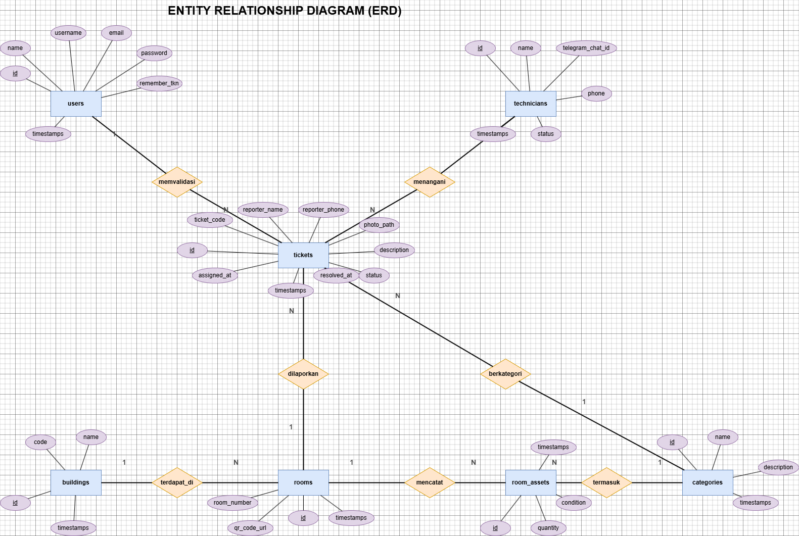

### 2. Use Case Diagram
Diagram interaksi setiap aktor terhadap fungsionalitas sistem.


### 3. Data Flow Diagram (DFD Level 1)
Aliran data antar proses dalam sistem.


### 4. User Flow
Alur interaksi pengguna pada sistem.


---

## Tampilan Aplikasi (UI/UX)

### Tampilan Publik (Mahasiswa)

Form Pelaporan Kerusakan Aset Kelas
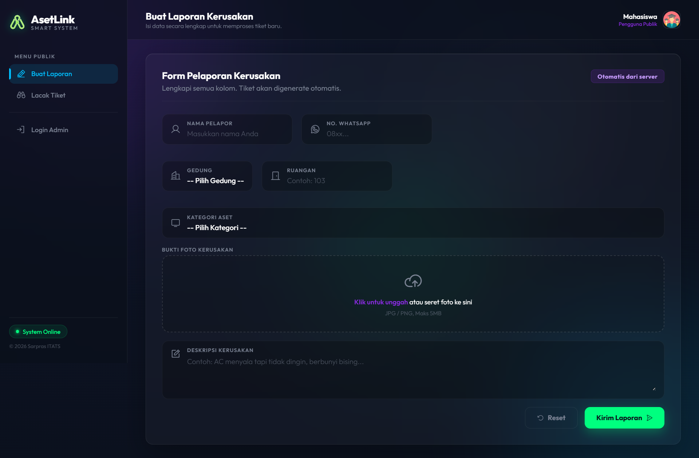

Lacak Status Tiket
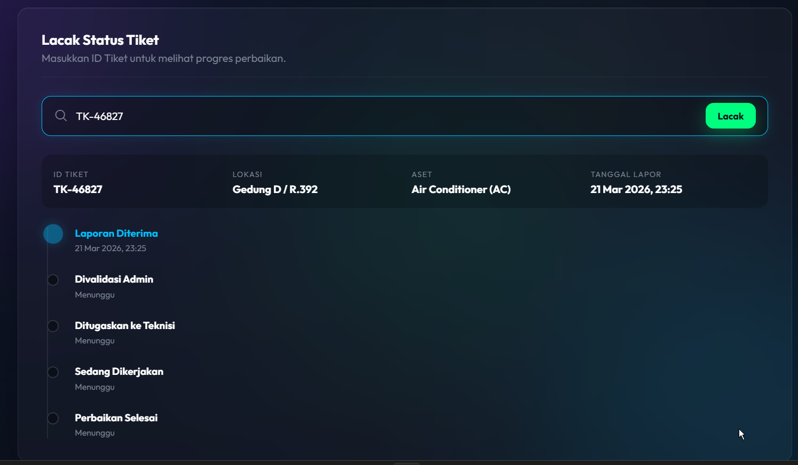

---

### Tampilan Admin (Panel Sarpras)

Dashboard Analitik — Statistik performa pemeliharaan
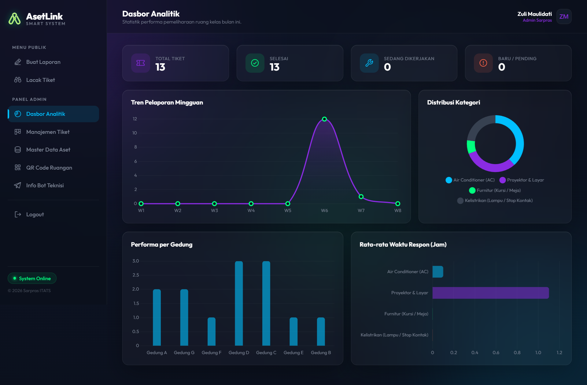

Manajemen Tiket — Papan Kanban penugasan kerusakan
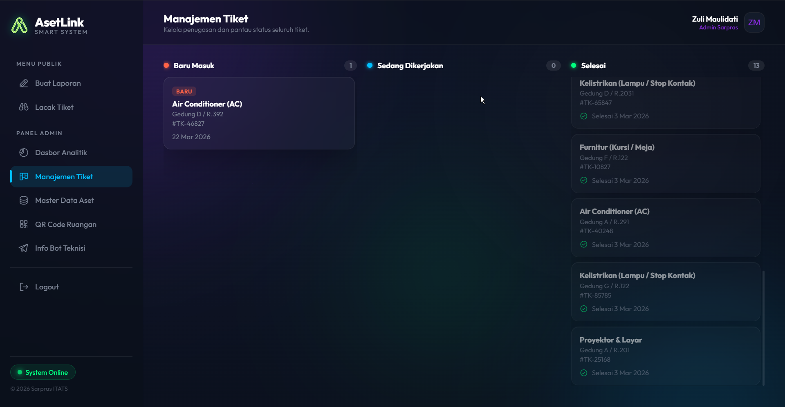

Pilih & Tugaskan Teknisi
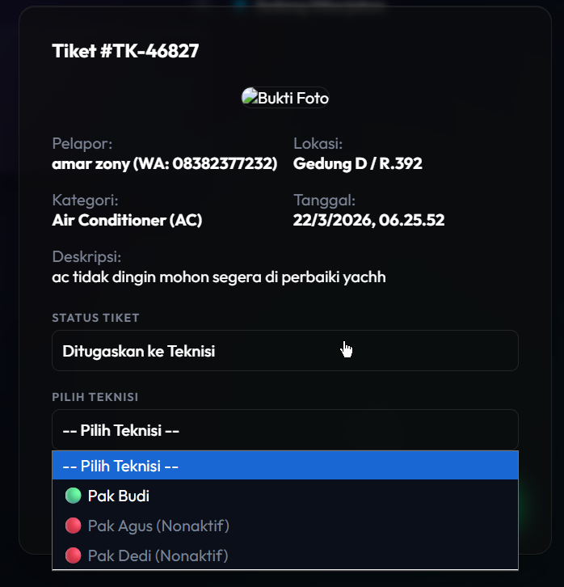
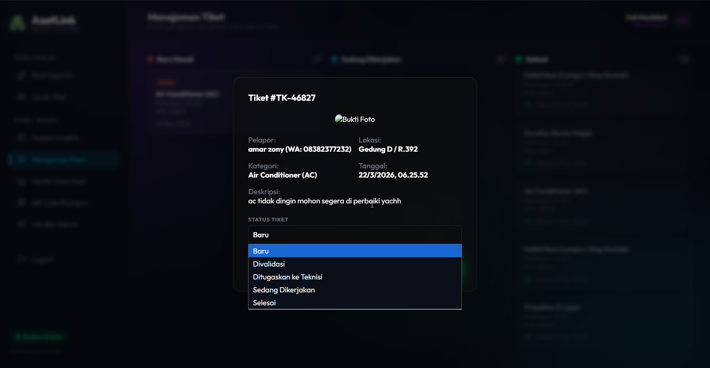

Master Data Aset
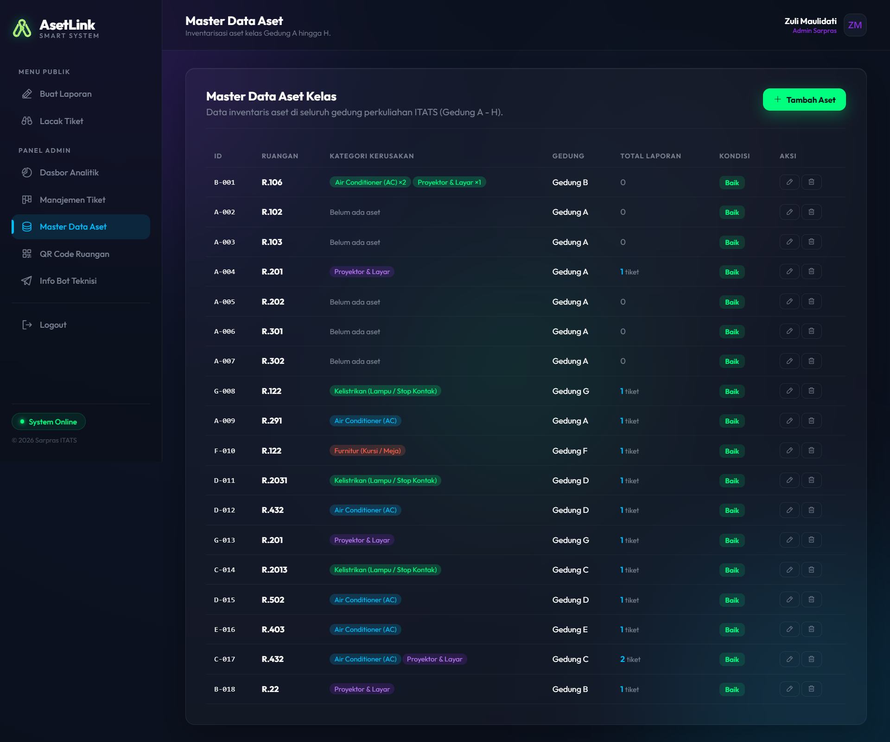

Inventarisasi Aset per Ruangan
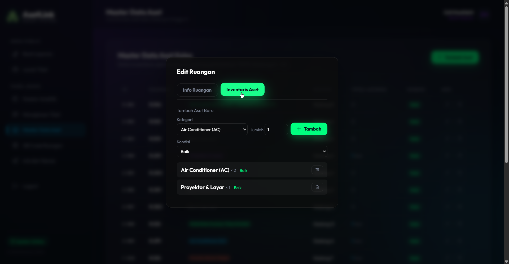

Tambah Ruangan Baru
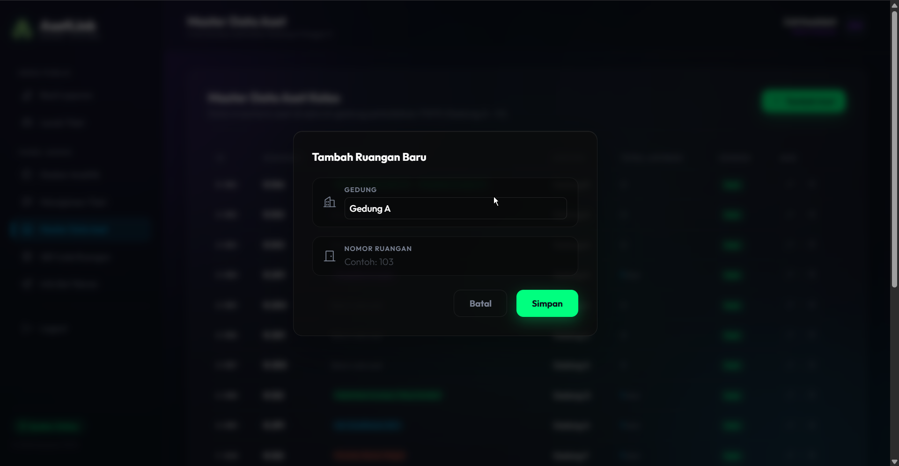

QR Code Generator Ruangan
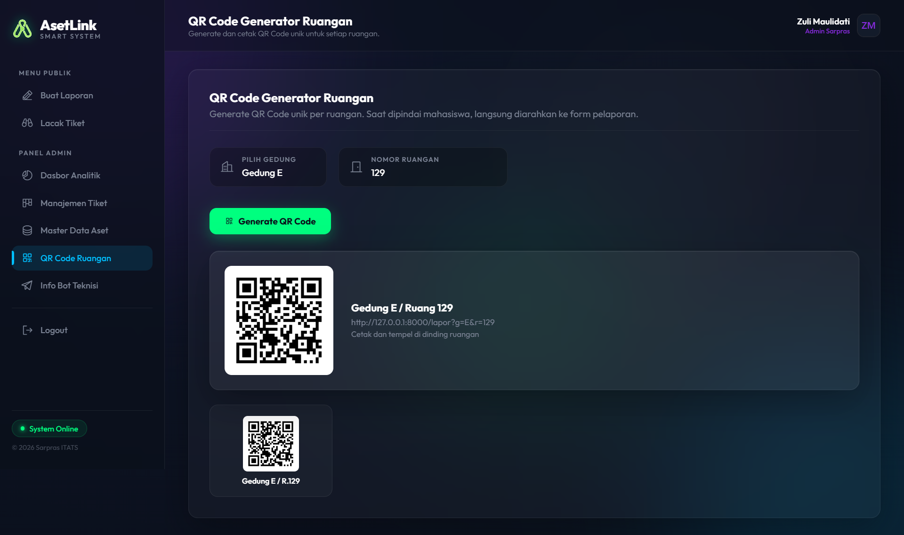

---

### Tampilan Teknisi (via Telegram Bot)

Notifikasi tugas masuk ke teknisi via Telegram
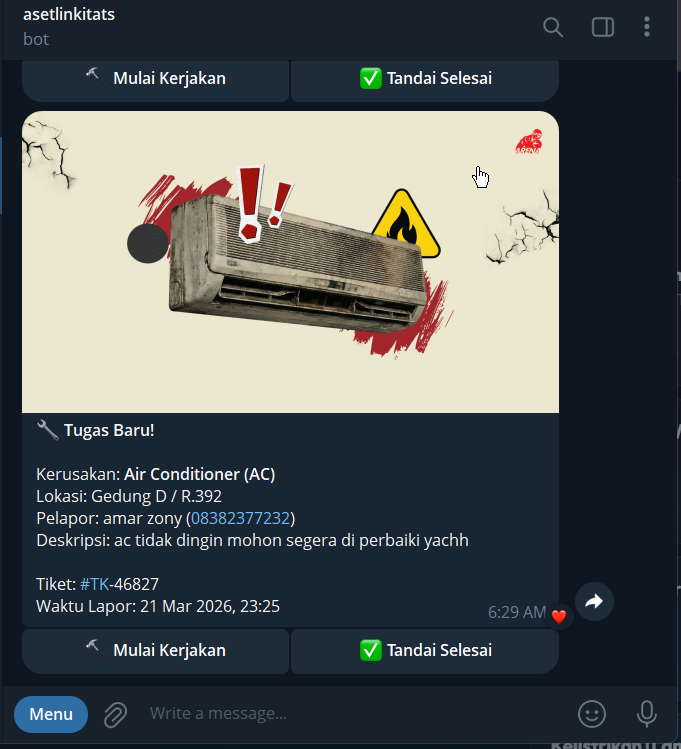

---

## Menjalankan Aplikasi

Aplikasi berjalan pada ekosistem lokal PC anda menggunakan stack berikut:
- **PHP** >= 8.2
- **Composer** v2+
- **Node.js** v20+
- **Database** MySQL 8.0

### Menjalankan via Docker (Recommended)

Pada project ini sudah disediakan Docker Compose untuk menjalankan.

```bash
docker compose up -d --build
```

Setelah dijalankan, akses URL berikut:
- **Frontend App:** `http://localhost`
- **Backend/API:** `http://localhost:8000`

Login Admin: `http://localhost/login`
| Field | Value |
|-------|-------|
| Username | `admin` |
| Password | `qwe123` |

### Menjalankan Tanpa Docker (Manual)

**1. Siapkan Database**

Buat database MySQL dengan nama `asetlink`, pastikan service MySQL/MariaDB sudah berjalan di komputer Anda.

**2. Setup Backend**

```bash
cd backend
composer install
copy .env.example .env
```

Sesuaikan file `.env` pada bagian database:
```
DB_CONNECTION=mysql
DB_HOST=127.0.0.1
DB_PORT=3306
DB_DATABASE=asetlink
DB_USERNAME=root
DB_PASSWORD=
```

Lanjutkan:
```bash
php artisan key:generate
php artisan migrate --force
php artisan db:seed --force
php artisan storage:link
php artisan serve --port=8000
```

**3. Setup Frontend**

Buka terminal baru:
```bash
cd frontend
npm install
npm run dev
```

**4. Akses Aplikasi**
- **Backend/API:** `http://localhost:8000`
- **Frontend App:** `http://localhost:5173`

---

## Struktur Project

```
asetlinkV2/
|-- backend/                        # Laravel 12 (REST API)
|   |-- app/
|   |   |-- Http/
|   |   |   |-- Controllers/
|   |   |   |   |-- AuthController.php      # Login & Logout Admin
|   |   |   |   |-- TicketController.php    # CRUD Tiket Kerusakan
|   |   |   |   |-- BuildingController.php  # Master Data Gedung
|   |   |   |   |-- RoomController.php      # Master Data Ruangan
|   |   |   |   |-- DashboardController.php # Statistik & Chart
|   |   |   |   |-- TechnicianController.php
|   |   |-- Models/
|   |-- database/
|   |   |-- migrations/             # file migrasi tabel
|   |   |-- seeders/
|   |-- routes/
|   |   |-- api.php                 # Seluruh definisi route REST API
|   |-- public/
|   |-- Dockerfile
|   |-- .env.example
|   |-- .env.docker
|   |-- composer.json
|
|-- frontend/                       # Vue.js 3 + Vite (SPA)
|   |-- src/
|   |   |-- services/              # Axios instance & API calls
|   |   |-- assets/                # CSS & aset statis
|   |   |-- components/            # Komponen reusable (Toast, ConfirmDialog)
|   |   |-- composables/           # useToast composable
|   |   |-- layouts/               # AppLayout (sidebar & topbar)
|   |   |-- pages/                 # Halaman SPA
|   |   |   |-- ReportPage.vue     # Form pelaporan kerusakan
|   |   |   |-- TrackPage.vue      # Lacak status tiket
|   |   |   |-- LoginPage.vue      # Login admin
|   |   |   |-- DashboardPage.vue  # Dashboard analitik
|   |   |   |-- TicketsPage.vue    # Kanban manajemen tiket
|   |   |   |-- MasterPage.vue     # Master data aset & ruangan
|   |   |   |-- QrCodePage.vue     # QR Code generator
|   |   |   |-- TelegramPage.vue   # Info bot Telegram teknisi
|   |   |-- router/
|   |   |-- stores/                # Pinia state management (auth)
|   |   |-- App.vue
|   |   |-- main.js
|   |-- Dockerfile
|   |-- nginx.conf
|   |-- package.json
|   |-- vite.config.js
|
|-- flowcharts/
|   |-- diagram/                   # ERD, Use Case, DFD, User Flow
|   |-- previews/                  # Screenshot UI per aktor
|       |-- admin/
|       |-- mhs/
|       |-- teknisi/
|
|-- docker-compose.yml
|-- .gitignore
|-- README.md
```

---

## Lisensi

Project ini dilisensikan di bawah [MIT License](LICENSE).

```
MIT License

Copyright (c) 2026 Cybha

Permission is hereby granted, free of charge, to any person obtaining a copy
of this software and associated documentation files (the "Software"), to deal
in the Software without restriction, including without limitation the rights
to use, copy, modify, merge, publish, distribute, sublicense, and/or sell
copies of the Software, and to permit persons to whom the Software is
furnished to do so, subject to the following conditions:

The above copyright notice and this permission notice shall be included in all
copies or substantial portions of the Software.

THE SOFTWARE IS PROVIDED "AS IS", WITHOUT WARRANTY OF ANY KIND, EXPRESS OR
IMPLIED, INCLUDING BUT NOT LIMITED TO THE WARRANTIES OF MERCHANTABILITY,
FITNESS FOR A PARTICULAR PURPOSE AND NONINFRINGEMENT. IN NO EVENT SHALL THE
AUTHORS OR COPYRIGHT HOLDERS BE LIABLE FOR ANY CLAIM, DAMAGES OR OTHER
LIABILITY, WHETHER IN AN ACTION OF CONTRACT, TORT OR OTHERWISE, ARISING FROM,
OUT OF OR IN CONNECTION WITH THE SOFTWARE OR THE USE OR OTHER DEALINGS IN THE
SOFTWARE.
```
